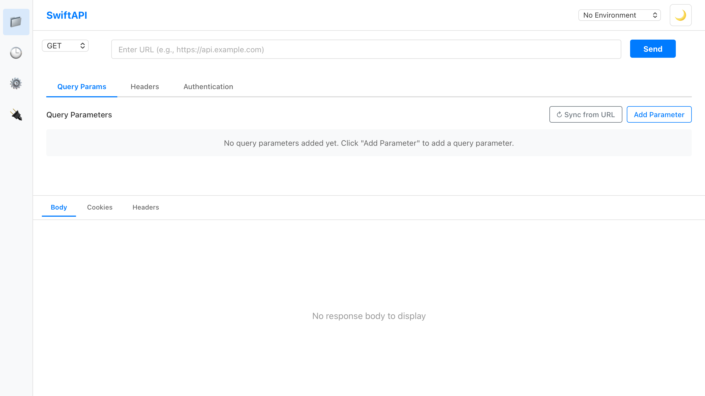

# SwiftAPI User Guide

Welcome to SwiftAPI - a fast, lightweight, and privacy-focused API testing client.

## Table of Contents

1. [Getting Started](#getting-started)
2. [Making Your First Request](#making-your-first-request)
3. [Working with Collections](#working-with-collections)
4. [Managing Environments](#managing-environments)
5. [Request Configuration](#request-configuration)
6. [Viewing Responses](#viewing-responses)
7. [Request History](#request-history)
8. [Keyboard Shortcuts](#keyboard-shortcuts)
9. [Tips and Best Practices](#tips-and-best-practices)

---

## Getting Started

SwiftAPI is a desktop application built for API developers who value:

- **Speed**: Lightning-fast request execution
- **Privacy**: All data stored locally, no cloud sync required
- **Simplicity**: Clean, intuitive interface without unnecessary complexity
- **Cross-platform**: Works on Windows, macOS, and Linux



### Main Interface Overview

The SwiftAPI interface consists of four main areas:

1. **Collections Sidebar** (left): Organize requests into collections
2. **Request Builder** (top): Configure your HTTP requests
3. **Response Viewer** (bottom): View API responses
4. **Environment Selector** (top right): Switch between environments

---

## Making Your First Request

### Step 1: Select HTTP Method

Use the method dropdown to select your HTTP method:
- GET (default)
- POST
- PUT
- PATCH
- DELETE
- HEAD
- OPTIONS

### Step 2: Enter URL

Type or paste your API endpoint URL in the URL input field. You can use:
- Plain URLs: `https://api.example.com/users`
- URLs with variables: `{{base_url}}/users/{{user_id}}`

### Step 3: Send the Request

Click the **Send** button or use the keyboard shortcut:
- **macOS**: `Cmd + Enter`
- **Windows/Linux**: `Ctrl + Enter`

The response will appear in the Response Viewer section below.

---

## Working with Collections

Collections help you organize related requests together.

### Creating a Collection

1. Click the **+** button in the Collections sidebar
2. Enter a collection name (e.g., "GitHub API", "User Management")
3. Click **Create**

### Saving a Request

1. Configure your request (method, URL, headers, body, etc.)
2. Click the **Save** button or press `Cmd/Ctrl + S`
3. Enter a request name (e.g., "Get User Profile")
4. Select a collection or create a new one
5. Click **Save Request**

Your request is now saved and will appear in the Collections sidebar.

### Managing Collections

Right-click on a collection to:
- Rename the collection
- Delete the collection
- Export collection (coming soon)

### Loading a Saved Request

Simply click on any saved request in the Collections sidebar to load it into the Request Builder.

---

## Managing Environments

Environments allow you to manage different sets of variables for development, staging, and production.

### Creating an Environment

1. Click the **Environment** dropdown in the top-right corner
2. Click **Manage Environments**
3. Click **Create New Environment**
4. Enter a name (e.g., "Development", "Production")
5. Click **Create**

### Adding Variables

1. Open **Manage Environments**
2. Select your environment
3. Click **Add Variable**
4. Enter the variable name (e.g., `base_url`)
5. Enter the variable value (e.g., `https://api.dev.example.com`)
6. Click **Save**

### Using Variables in Requests

Reference variables using double curly braces:

```
{{base_url}}/users/{{user_id}}
```

Variables are automatically replaced with their values when you send the request.

### Switching Environments

Use the Environment dropdown in the top-right corner to switch between environments. The active environment's variables will be used in all requests.

---

## Request Configuration

### Query Parameters

Use the **Query Params** tab to add URL query parameters:

1. Click **Add Parameter**
2. Enter the key (e.g., `page`)
3. Enter the value (e.g., `1`)
4. Toggle the checkbox to enable/disable individual parameters

### Headers

Use the **Headers** tab to add HTTP headers:

1. Click **Add Header**
2. Enter the header name (e.g., `Content-Type`)
3. Enter the header value (e.g., `application/json`)
4. Common headers are auto-suggested

### Request Body

Use the **Body** tab to configure the request body (for POST, PUT, PATCH):

**Body Types:**
- **None**: No request body
- **JSON**: Structured JSON data with syntax highlighting
- **Raw Text**: Plain text or other formats
- **Form Data**: Multipart form data (coming soon)
- **URL Encoded**: x-www-form-urlencoded data (coming soon)

### Authentication

Use the **Authentication** tab to configure authentication:

**Auth Types:**
- **No Auth**: No authentication
- **Bearer Token**: JWT or OAuth bearer tokens
- **Basic Auth**: Username and password
- **API Key**: Custom API key header
- **OAuth 2.0**: OAuth 2.0 flow (coming soon)

---

## Viewing Responses

### Response Status

The Status Display shows:
- **Status Code**: HTTP status code with color coding
  - Green: 2xx (success)
  - Blue: 3xx (redirect)
  - Yellow: 4xx (client error)
  - Red: 5xx (server error)
- **Response Time**: Time taken in milliseconds
- **Response Size**: Size of the response body

### Response Body

The Body Viewer displays:
- **JSON**: Pretty-printed with syntax highlighting
- **HTML**: Formatted HTML (preview coming soon)
- **XML**: Formatted XML
- **Text**: Plain text
- **Images**: Image preview (coming soon)

### Response Headers

Use the **Headers** tab in the Response section to view all response headers.

---

## Request History

SwiftAPI automatically tracks your request history.

### Viewing History

1. Click the **History** icon in the toolbar
2. Browse your recent requests
3. Click any request to load it into the Request Builder

### Clearing History

Right-click in the History panel and select **Clear History** to remove all entries.

---

## Keyboard Shortcuts

Boost your productivity with these keyboard shortcuts:

### Global Shortcuts

| Action | macOS | Windows/Linux |
|--------|-------|---------------|
| Send Request | `Cmd + Enter` | `Ctrl + Enter` |
| Save Request | `Cmd + S` | `Ctrl + S` |
| Open History | `Cmd + H` | `Ctrl + H` |
| Focus URL Input | `Cmd + L` | `Ctrl + L` |
| New Request | `Cmd + N` | `Ctrl + N` |

### Editor Shortcuts

When editing JSON or text in the Body editor:

| Action | macOS | Windows/Linux |
|--------|-------|---------------|
| Format JSON | `Cmd + Shift + F` | `Ctrl + Shift + F` |
| Find | `Cmd + F` | `Ctrl + F` |
| Replace | `Cmd + H` | `Ctrl + H` |

---

## Tips and Best Practices

### 1. Use Environment Variables

Instead of hardcoding URLs, use environment variables:

```
{{base_url}}/api/v1/users
```

This makes it easy to switch between development, staging, and production environments.

### 2. Organize with Collections

Group related requests into collections:
- **Users API**: All user-related endpoints
- **Products API**: All product-related endpoints
- **Authentication**: Login, logout, refresh token endpoints

### 3. Name Requests Clearly

Use descriptive names for saved requests:
- Good: "Get User by ID", "Create New Product", "Update Profile"
- Avoid: "Request 1", "Test", "API Call"

### 4. Use Authentication Variables

Store sensitive tokens in environment variables:

```json
{
  "auth_token": "eyJhbGciOiJIUzI1NiIsInR5cCI6IkpXVCJ9..."
}
```

Then reference them in headers:
```
Authorization: Bearer {{auth_token}}
```

### 5. Monitor Response Times

Keep an eye on the response time indicator to identify slow endpoints that may need optimization.

### 6. Test Error Cases

Don't just test happy paths. Try:
- Invalid authentication tokens
- Missing required fields
- Invalid data types
- Edge cases and boundary conditions

### 7. Use Request History

If you need to re-run a modified request, check the History panel to see what parameters you used previously.

---

## Privacy and Data Storage

SwiftAPI is committed to your privacy:

- **Local-First**: All data is stored locally on your machine
- **No Cloud Sync**: No data is sent to external servers
- **No Tracking**: No analytics or telemetry
- **No Account Required**: No registration or login needed

Your collections, environments, and request history are stored in:
- **macOS**: `~/Library/Application Support/swiftapi/`
- **Windows**: `%APPDATA%/swiftapi/`
- **Linux**: `~/.config/swiftapi/`

---

## Troubleshooting

### Request Times Out

If your request times out:
1. Check your internet connection
2. Verify the URL is correct
3. Check if the server is responding
4. Increase timeout settings (coming soon)

### SSL/TLS Errors

If you encounter SSL certificate errors:
1. Verify the server's SSL certificate is valid
2. For development servers, you can disable SSL verification (coming soon)

### Response Not Displaying

If the response doesn't display:
1. Check the Console for errors (Help > Developer Tools)
2. Verify the response Content-Type header
3. Try viewing the raw response

### Variables Not Resolving

If variables aren't being replaced:
1. Check that the environment is selected
2. Verify the variable name matches exactly (case-sensitive)
3. Ensure the variable is defined in the active environment

---

## Getting Help

Need assistance? Here's how to get help:

- **GitHub Issues**: Report bugs and request features at [github.com/yourusername/swiftapi/issues](https://github.com/yourusername/swiftapi/issues)
- **Documentation**: Visit our docs at [swiftapi.dev/docs](https://swiftapi.dev/docs)
- **Community**: Join discussions on GitHub Discussions

---

## What's Next?

SwiftAPI is under active development. Upcoming features include:

- GraphQL support
- WebSocket testing
- Mock servers
- Request chaining and scripting
- Response validation and testing
- Import/Export (Postman, Insomnia, OpenAPI)
- Team collaboration features
- Custom themes

---

## Contributing

SwiftAPI is open source! Contributions are welcome:

1. Fork the repository
2. Create a feature branch
3. Make your changes
4. Submit a pull request

See [CONTRIBUTING.md](../CONTRIBUTING.md) for detailed guidelines.

---

## License

SwiftAPI is licensed under the MIT License. See [LICENSE](../LICENSE) for details.

---

**Built with care for the API development community.**
