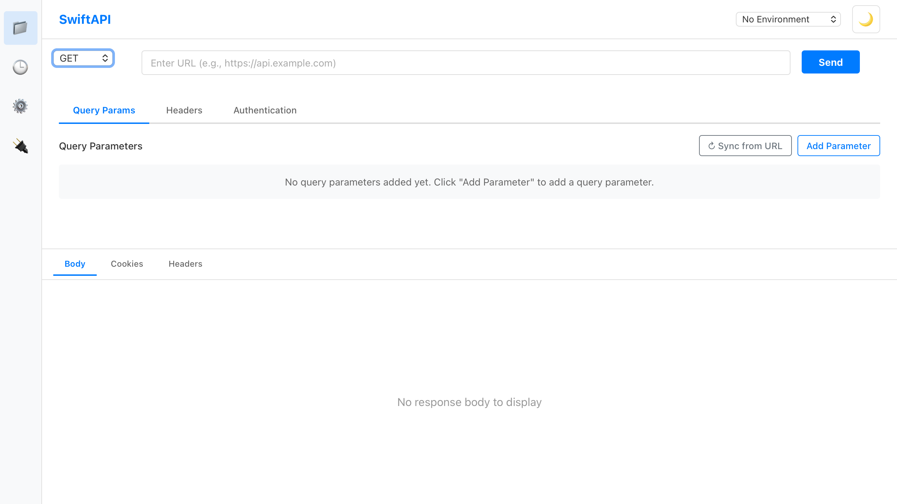
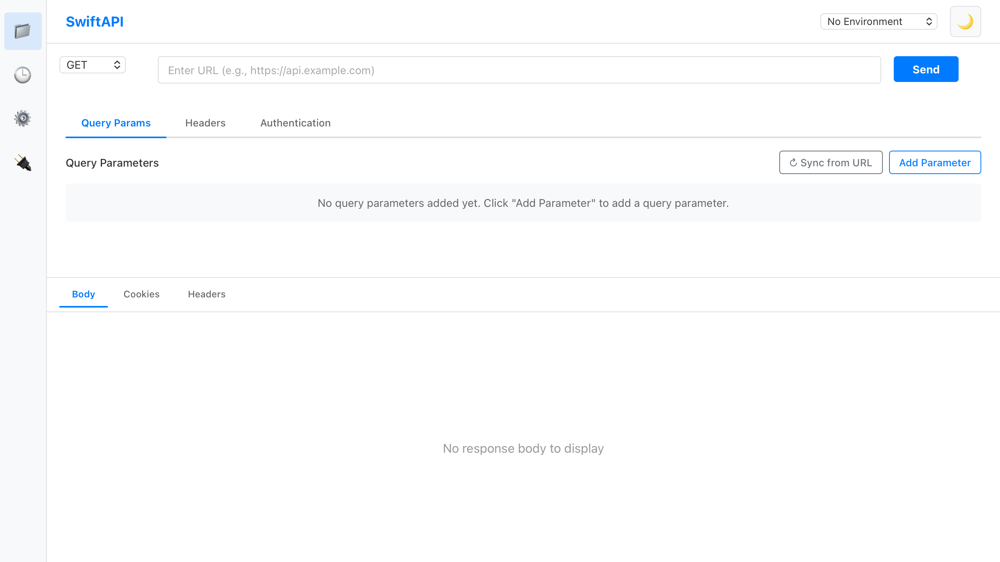

# SwiftAPI Interactive Training Tutorial

> **Welcome!** This hands-on tutorial will teach you everything you need to know about SwiftAPI, from making your first API request to advanced features like mock servers. Each exercise includes step-by-step instructions with screenshots.

## 📋 Table of Contents

1. [Before You Start](#before-you-start)
2. [Module 1: Your First API Request](#module-1-your-first-api-request)
3. [Module 2: Understanding the Interface](#module-2-understanding-the-interface)
4. [Module 3: Collections - Organizing Your Work](#module-3-collections---organizing-your-work)
5. [Module 4: Environments - Managing Variables](#module-4-environments---managing-variables)
6. [Module 5: Mock Servers - Testing Without a Backend](#module-5-mock-servers---testing-without-a-backend)
7. [Module 6: Advanced Features](#module-6-advanced-features)
8. [Quick Reference Guide](#quick-reference-guide)
9. [Troubleshooting](#troubleshooting)

---

## Before You Start

### What is an API?

**API** (Application Programming Interface) is a way for different software programs to talk to each other. Think of it like a waiter in a restaurant:
- **You** (the client) place an order
- **The waiter** (the API) takes your order to the kitchen
- **The kitchen** (the server) prepares your food
- **The waiter** brings your food back to you

In technical terms:
- **Request**: What you ask for (like ordering food)
- **Response**: What you get back (like receiving your meal)

### What You'll Learn

By the end of this tutorial, you'll be able to:
- ✅ Make GET, POST, PUT, and DELETE requests
- ✅ Organize requests into collections
- ✅ Use environments to switch between dev/staging/production
- ✅ Create mock servers for testing
- ✅ Understand API responses and troubleshoot issues

### Prerequisites

- SwiftAPI installed on your computer
- Basic computer skills (no programming required!)
- Internet connection (for some exercises)

### Estimated Time

- **Fast Track**: 30 minutes (core features only)
- **Complete Tutorial**: 90 minutes (all modules)

---

## Module 1: Your First API Request

**Time: 10 minutes** | **Difficulty: Beginner**

### What You'll Learn
- How to make a GET request
- How to read API responses
- Understanding HTTP status codes

### Exercise 1.1: Make Your First Request

**Goal**: Get information about a GitHub user

#### Step 1: Open SwiftAPI

Launch SwiftAPI on your computer. You'll see the main interface:


**Key Areas**:
1. **Sidebar** (left): Navigate between Collections, History, and Mock Servers
2. **Request Builder** (center/top): Where you configure your API requests
3. **Response Viewer** (center/bottom): Where you see the results
4. **Top Bar** (right): Environment selector and theme toggle

#### Step 2: Enter the URL

In the URL input field, type:
```
https://api.github.com/users/octocat
```


💡 **What's happening?**: You're telling SwiftAPI to connect to GitHub's API and ask for information about the user "octocat".

#### Step 3: Click Send

Click the blue **Send** button (or press `Ctrl+Enter` / `Cmd+Enter`)


#### Step 4: View the Response

After a moment, you'll see the response in the bottom panel:


**Understanding the Response**:

1. **Status Code** (top right):
   - `200 OK` = Success! ✅
   - `404 Not Found` = Resource doesn't exist ❌
   - `500 Server Error` = Server problem ⚠️

2. **Response Time**: How long the request took (e.g., 234ms)

3. **Response Body**: The actual data returned (JSON format)

### Exercise 1.2: Understanding the Response

The response you see is in **JSON** format. Here's how to read it:

```json
{
  "login": "octocat",           // Username
  "id": 583231,                 // User ID
  "name": "The Octocat",        // Display name
  "company": "@github",         // Company
  "location": "San Francisco",  // Location
  "public_repos": 8,            // Number of public repositories
  "followers": 10000,           // Number of followers
  ...
}
```

💡 **Try This**:
- Replace "octocat" with your own GitHub username
- Click Send again
- See your own profile information!

### Exercise 1.3: Try Different HTTP Methods

APIs support different **HTTP methods** for different actions:

| Method | Purpose | Example |
|--------|---------|---------|
| **GET** | Read data | Get user info |
| **POST** | Create new data | Create a new user |
| **PUT** | Update existing data | Update user profile |
| **DELETE** | Remove data | Delete a user |

**Try this**:
1. Click the method dropdown (currently shows "GET")
2. Notice the other options available



⚠️ **Note**: For now, stick with GET requests. We'll cover other methods later.

### 🎯 Module 1 Challenge

**Task**: Make a GET request to this URL and find the answer:
```
https://api.github.com/users/github
```

**Questions**:
1. What is the GitHub user's real name?
2. How many public repositories do they have?
3. What was the response time?

✅ **You've completed Module 1!** You now know how to make basic API requests and read responses.

---

## Module 2: Understanding the Interface

**Time: 15 minutes** | **Difficulty: Beginner**

### What You'll Learn
- Navigating the SwiftAPI interface
- Using request tabs (Headers, Body, Auth)
- Reading response tabs (Body, Headers, Cookies)

### Exercise 2.1: Explore the Request Tabs

SwiftAPI organizes request configuration into tabs:


#### Query Params Tab
Use this to add parameters to your URL.

**Example**: Search GitHub users
- URL: `https://api.github.com/search/users`
- Query Param: `q` = `location:san francisco`
- Result URL: `https://api.github.com/search/users?q=location:san francisco`

#### Headers Tab
Headers provide additional information about your request.

**Common Headers**:
- `Content-Type`: What kind of data you're sending
- `Authorization`: Your authentication credentials
- `Accept`: What kind of data you want back

**Try This**:
1. Click the **Headers** tab
2. Click **Add Header**
3. Add header: `Accept` = `application/json`
4. Send the request

#### Body Tab
Used for POST and PUT requests to send data.

**Body Types**:
- **None**: No body data (GET requests)
- **JSON**: Structured data `{"key": "value"}`
- **Text**: Plain text
- **Form**: Form data (coming soon)

#### Authentication Tab
Configure authentication for protected APIs.

**Auth Types**:
- **No Auth**: Public APIs
- **Bearer Token**: JWT tokens (common for modern APIs)
- **Basic Auth**: Username + password
- **API Key**: Custom API keys

### Exercise 2.2: Explore Response Tabs

After making a request, you can view different aspects of the response:


#### Body Tab (Default)
Shows the actual response data with syntax highlighting.

**Features**:
- **Pretty Print**: Formatted JSON
- **Line Numbers**: Easy reference
- **Syntax Highlighting**: Color-coded JSON

#### Headers Tab
Shows all HTTP headers returned by the server.

**Useful Headers**:
- `Content-Type`: Type of data returned
- `Date`: When the response was generated
- `Cache-Control`: Caching instructions
- `Server`: Server software version

#### Cookies Tab
Shows cookies sent by the server (for session management).

### Exercise 2.3: Making a POST Request

Let's try sending data to an API.

**Try This**:
1. Change method to **POST**
2. URL: `https://httpbin.org/post`
3. Click **Body** tab
4. Select **JSON**
5. Enter this JSON:
```json
{
  "name": "Your Name",
  "role": "Tester",
  "message": "Hello from SwiftAPI!"
}
```
6. Click **Send**

**Expected Response**: You'll see your data echoed back in the response!

### 🎯 Module 2 Challenge

**Task**: Make a POST request to `https://httpbin.org/post` with the following:

**Headers**:
- `Content-Type`: `application/json`
- `X-Custom-Header`: `training-exercise`

**Body** (JSON):
```json
{
  "username": "your-name",
  "department": "your-department",
  "completed_module": 2
}
```

**Questions**:
1. What status code did you receive?
2. Can you find your custom header in the response?
3. Is your body data echoed back?

✅ **You've completed Module 2!** You now understand the SwiftAPI interface and can configure complex requests.

---

## Module 3: Collections - Organizing Your Work

**Time: 15 minutes** | **Difficulty: Beginner**

### What You'll Learn
- Creating and organizing collections
- Saving requests for reuse
- Managing saved requests

### Why Use Collections?

Imagine you're testing a user management API with 20 different endpoints. Without collections:
- ❌ You'd have to manually enter each URL every time
- ❌ You'd lose track of which requests you've tested
- ❌ You couldn't share your requests with teammates

With collections:
- ✅ Save all 20 requests in one place
- ✅ Organize them by feature (Users, Posts, Comments)
- ✅ Reuse them anytime with one click

### Exercise 3.1: View Collections Sidebar

Click the **Collections** button in the left sidebar:


**What You'll See**:
- List of your saved collections
- + New Collection button
- Search/filter options

### Exercise 3.2: Create Your First Collection

**Scenario**: You're testing a social media API. Let's organize our requests.

#### Step 1: Create a Collection
1. Click **+ New Collection** (or **Create Collection**)
2. Name it: `Social Media API`
3. Click **Create**


#### Step 2: Make and Save a Request

1. Make a GET request to: `https://api.github.com/users/octocat`
2. Click **Send** to test it
3. Click the **Save** button (or press `Ctrl+S` / `Cmd+S`)


4. Enter request name: `Get User Profile`
5. Select collection: `Social Media API`
6. Click **Save Request**

✅ **Success!** Your request is now saved.

### Exercise 3.3: Build a Complete Collection

Let's create a collection of related requests:

**Collection Name**: `GitHub API Testing`

**Requests to Save**:

| Request Name | Method | URL |
|--------------|--------|-----|
| Get User | GET | `https://api.github.com/users/octocat` |
| Get Repositories | GET | `https://api.github.com/users/octocat/repos` |
| Get Followers | GET | `https://api.github.com/users/octocat/followers` |
| Search Users | GET | `https://api.github.com/search/users?q=location:london` |

**Steps**:
1. Create collection: `GitHub API Testing`
2. Make each request above
3. Save each one with the specified name
4. Verify all 4 requests appear in your collection

### Exercise 3.4: Using Saved Requests

**Benefits of Saved Requests**:
- Click any saved request to load it instantly
- No need to remember URLs
- Easy to retry failed requests
- Perfect for regression testing

**Try This**:
1. Open Collections sidebar
2. Click on `Get User`
3. Notice the URL and method load automatically
4. Click **Send**

### Exercise 3.5: Managing Collections

**Available Actions** (right-click on collection):
- **Rename**: Change collection name
- **Duplicate**: Create a copy
- **Delete**: Remove collection (with confirmation)
- **Export**: Save to file (coming soon)

### 🎯 Module 3 Challenge

**Task**: Create a collection called `API Testing Practice` with the following requests:

1. **Request**: Get Random User
   - URL: `https://randomuser.me/api/`
   - Method: GET

2. **Request**: Get Multiple Users
   - URL: `https://randomuser.me/api/?results=5`
   - Method: GET

3. **Request**: Post Test Data
   - URL: `https://httpbin.org/post`
   - Method: POST
   - Body: Any JSON data you want

**Verification**:
- All 3 requests saved
- All requests work when clicked
- Collection is organized and named correctly

✅ **You've completed Module 3!** You can now organize your API requests efficiently.

---

## Module 4: Environments - Managing Variables

**Time: 20 minutes** | **Difficulty: Intermediate**

### What You'll Learn
- Creating environments (Dev, Staging, Production)
- Using variables in requests
- Switching between environments

### Why Use Environments?

**Problem**: You're testing an API that has three versions:
- **Development**: `https://api-dev.example.com`
- **Staging**: `https://api-staging.example.com`
- **Production**: `https://api.example.com`

Without environments:
- ❌ You'd have to manually change URLs for each environment
- ❌ Risk of accidentally testing production
- ❌ Hard to share requests with different configurations

With environments:
- ✅ Define URLs once as variables
- ✅ Switch environments with one click
- ✅ Keep production safe with clear labeling

### Exercise 4.1: Understanding Variables

Variables let you reuse values across multiple requests.

**Syntax**: `{{variable_name}}`

**Example**:
- Variable: `base_url` = `https://api.github.com`
- URL: `{{base_url}}/users/octocat`
- Result: `https://api.github.com/users/octocat`

### Exercise 4.2: Create Your First Environment

#### Step 1: Open Environment Selector

Look for the environment dropdown in the top-right corner:


#### Step 2: Manage Environments
1. Click the environment dropdown
2. Click **Manage Environments** (or similar button)
3. Click **+ New Environment**

#### Step 3: Create Development Environment
1. Name: `Development`
2. Add variables:
   - `base_url` = `https://api-dev.example.com`
   - `api_key` = `dev_12345`
   - `user_id` = `test-user`
3. Click **Save**

#### Step 4: Create Additional Environments

Repeat for:

**Staging**:
- `base_url` = `https://api-staging.example.com`
- `api_key` = `staging_67890`
- `user_id` = `staging-user`

**Production** (⚠️ be careful!):
- `base_url` = `https://api.example.com`
- `api_key` = `prod_xxxxx`
- `user_id` = `real-user`

### Exercise 4.3: Using Variables in Requests


**Try This**:
1. Create a new request
2. URL: `{{base_url}}/users/{{user_id}}`
3. Select **Development** environment
4. Click **Send**

Notice: The variables are automatically replaced!

### Exercise 4.4: Advanced Variable Usage

Variables work in multiple places:

#### In URLs
```
{{base_url}}/api/v1/users/{{user_id}}
```

#### In Headers
```
Authorization: Bearer {{api_token}}
X-API-Key: {{api_key}}
```

#### In Body (JSON)
```json
{
  "userId": "{{user_id}}",
  "apiKey": "{{api_key}}",
  "environment": "{{env_name}}"
}
```

### Exercise 4.5: Switching Environments

**Real-World Scenario**: You've tested an API in Development and now need to test Staging.

**Steps**:
1. Make a request with variables in Development
2. Verify it works
3. Switch environment dropdown to **Staging**
4. Click **Send** again (same request)
5. Notice the different response (from staging server)

### Exercise 4.6: Environment Best Practices

✅ **DO**:
- Use clear environment names (Dev, Staging, Prod)
- Keep sensitive data (API keys) in environment variables
- Test in Dev/Staging before Production
- Use consistent variable names across environments

❌ **DON'T**:
- Don't hard-code URLs (use variables instead)
- Don't share production credentials
- Don't mix test and production data
- Don't forget which environment you're in!

### 🎯 Module 4 Challenge

**Task**: Set up a complete testing workflow

1. **Create Three Environments**:
   - Local (http://localhost:3000)
   - Testing (https://test.api.com)
   - Live (https://api.com)

2. **Define Variables** (in each environment):
   - `base_url`
   - `api_version` (e.g., v1, v2)
   - `timeout` (e.g., 5000, 3000)

3. **Create a Request** using all variables:
   - URL: `{{base_url}}/{{api_version}}/users`
   - Header: `X-Timeout` = `{{timeout}}`

4. **Test** in each environment and verify different values are used

✅ **You've completed Module 4!** You can now manage multiple environments and use variables effectively.

---

## Module 5: Mock Servers - Testing Without a Backend

**Time: 25 minutes** | **Difficulty: Intermediate**

### What You'll Learn
- Creating mock HTTP servers
- Configuring endpoints with custom responses
- Testing frontend applications without a real API

### Why Use Mock Servers?

**Scenarios where mock servers are essential**:

1. **Backend Not Ready**: Frontend team waiting for API
2. **Offline Development**: No internet connection
3. **Testing Edge Cases**: Simulate errors and slow responses
4. **Prototyping**: Demo new features quickly
5. **Integration Testing**: Test without affecting production data

### Exercise 5.1: Understanding Mock Servers

A **mock server** is a fake API server that:
- Runs on your computer (e.g., `http://localhost:3000`)
- Returns pre-configured responses
- Doesn't require internet
- Is perfect for development and testing

### Exercise 5.2: Create Your First Mock Server

#### Step 1: Open Mock Servers Panel

Click **Mock Servers** in the left sidebar:


#### Step 2: Create New Server


1. Click **+ New Server** (or **Create Mock Server**)
2. Enter details:
   - **Name**: `User API Mock`
   - **Port**: `3001`
3. Click **Create**

✅ **Created!** You now have a mock server (not started yet).

#### Step 3: Add Your First Endpoint

1. Select your mock server from the list
2. Click **+ Add Endpoint**
3. Configure:
   - **Method**: GET
   - **Path**: `/users`
   - **Status Code**: 200
   - **Response Body**:
   ```json
   {
     "users": [
       {"id": 1, "name": "Alice", "email": "alice@example.com"},
       {"id": 2, "name": "Bob", "email": "bob@example.com"},
       {"id": 3, "name": "Charlie", "email": "charlie@example.com"}
     ]
   }
   ```
4. Click **Save Endpoint**

#### Step 4: Start the Mock Server

1. Click **Start Server** button
2. Wait for status to show "Running" (green)
3. Note the URL: `http://localhost:3001`

### Exercise 5.3: Test Your Mock Server

**Now let's use it!**

1. Switch to the main request area
2. Method: GET
3. URL: `http://localhost:3001/users`
4. Click **Send**

**Result**: You should see your mock user list!

### Exercise 5.4: Create a Complete Mock API

Let's build a realistic user management API:

**Endpoint 1: Get All Users**
- Method: GET
- Path: `/users`
- Status: 200
- Body: (user list from above)

**Endpoint 2: Get Single User**
- Method: GET
- Path: `/users/:id`
- Status: 200
- Body:
```json
{
  "id": 1,
  "name": "Alice",
  "email": "alice@example.com",
  "role": "admin",
  "created_at": "2024-01-15"
}
```

💡 **Path Parameters**: `:id` matches any value (e.g., `/users/1`, `/users/abc`)

**Endpoint 3: Create User (Success)**
- Method: POST
- Path: `/users`
- Status: 201
- Body:
```json
{
  "id": 4,
  "name": "New User",
  "created": true,
  "message": "User created successfully"
}
```

**Endpoint 4: User Not Found (Error)**
- Method: GET
- Path: `/users/999`
- Status: 404
- Body:
```json
{
  "error": "User not found",
  "code": "USER_NOT_FOUND",
  "requested_id": "999"
}
```

### Exercise 5.5: Advanced Mock Server Features

#### Response Delays

Simulate slow networks:
1. Edit an endpoint
2. Set **Delay**: `2000` (milliseconds)
3. Save
4. Test the endpoint - it now takes 2 seconds!

**Use Cases**:
- Test loading spinners
- Test timeout handling
- Simulate real-world conditions

#### Custom Headers

Add custom response headers:
1. Edit an endpoint
2. Add header: `X-Rate-Limit` = `100`
3. Add header: `X-Response-Time` = `fast`
4. Save
5. Test and check Response Headers tab

#### Disable/Enable Endpoints

Toggle endpoints without deleting:
1. Uncheck "Enabled" checkbox on endpoint
2. Request returns 404
3. Re-enable to restore

### Exercise 5.6: Real-World Use Case - Testing Frontend

**Scenario**: Your team is building a user dashboard that:
1. Fetches user list from `/users`
2. Displays loading state
3. Shows user details on click
4. Handles errors gracefully

**Testing with Mock Server**:

1. **Happy Path**: All endpoints return 200
2. **Loading State**: Add 3000ms delay to test spinner
3. **Error Handling**: Return 500 error to test error UI
4. **Empty State**: Return empty array to test "no users" message

### 🎯 Module 5 Challenge

**Task**: Create a complete blog API mock server

**Requirements**:
1. **Server Name**: `Blog API Mock`
2. **Port**: `3002`

**Endpoints to Create**:

| Method | Path | Status | Response |
|--------|------|--------|----------|
| GET | /posts | 200 | List of blog posts |
| GET | /posts/:id | 200 | Single post details |
| POST | /posts | 201 | Post created confirmation |
| DELETE | /posts/:id | 204 | No content (successful delete) |
| GET | /posts/999 | 404 | Post not found error |

**Extra Credit**:
- Add 1500ms delay to simulate slow response
- Add custom header: `X-API-Version: 2.0`
- Test all endpoints work correctly

✅ **You've completed Module 5!** You can now create mock servers to test without real APIs.

---

## Module 6: Advanced Features

**Time: 15 minutes** | **Difficulty: Intermediate**

### What You'll Learn
- Using dark mode
- Leveraging request history
- Keyboard shortcuts for productivity

### Exercise 6.1: Dark Mode

Reduce eye strain with dark mode:



1. Look for the theme toggle button (sun/moon icon) in top-right
2. Click to switch between light and dark mode
3. Your preference is automatically saved

**Tips**:
- Use dark mode in low-light environments
- Matches your system theme by default
- Saves battery on OLED screens

### Exercise 6.2: Request History

Every request you make is automatically saved:


1. Click **History** in the left sidebar
2. See all your recent requests
3. Click any request to load it
4. Right-click to clear history

**Use Cases**:
- Retry failed requests
- Review what you tested yesterday
- Find that request you made earlier
- Track your testing progress

### Exercise 6.3: Keyboard Shortcuts

Be more productive with shortcuts:

| Action | Windows/Linux | Mac |
|--------|---------------|-----|
| Send Request | `Ctrl + Enter` | `Cmd + Enter` |
| Save Request | `Ctrl + S` | `Cmd + S` |
| New Request | `Ctrl + N` | `Cmd + N` |
| Focus URL | `Ctrl + L` | `Cmd + L` |

**Try This**:
1. Press `Ctrl/Cmd + L` to focus URL field
2. Type a URL
3. Press `Ctrl/Cmd + Enter` to send
4. Press `Ctrl/Cmd + S` to save

### 🎯 Module 6 Challenge

**Task**: Speed test challenge

1. Using **only keyboard shortcuts**:
   - Make 5 different GET requests to:
     - `https://api.github.com/users/github`
     - `https://api.github.com/users/microsoft`
     - `https://api.github.com/users/google`
     - `https://api.github.com/users/facebook`
     - `https://api.github.com/users/apple`
2. Save all 5 requests to a collection called "Tech Companies"
3. Time yourself - can you do it in under 2 minutes?

✅ **You've completed Module 6!** You're now a power user!

---

## Quick Reference Guide

### Common HTTP Status Codes

| Code | Meaning | What to Do |
|------|---------|-----------|
| 200 OK | Success | ✅ Everything worked |
| 201 Created | Resource created | ✅ POST was successful |
| 400 Bad Request | Invalid request | ❌ Check your request format |
| 401 Unauthorized | Not authenticated | ❌ Add authentication |
| 403 Forbidden | No permission | ❌ Check your permissions |
| 404 Not Found | Resource doesn't exist | ❌ Check the URL |
| 500 Server Error | Server problem | ⚠️ Contact API owner |

### JSON Basics

```json
{
  "string": "text value",
  "number": 123,
  "boolean": true,
  "null": null,
  "array": [1, 2, 3],
  "object": {
    "nested": "value"
  }
}
```

### Common HTTP Headers

| Header | Purpose | Example |
|--------|---------|---------|
| Content-Type | Data format | `application/json` |
| Authorization | Authentication | `Bearer abc123` |
| Accept | Desired format | `application/json` |
| User-Agent | Client identifier | `SwiftAPI/0.2.0` |

---

## Troubleshooting

### Problem: Request times out

**Solutions**:
1. Check your internet connection
2. Verify the URL is correct
3. Check if the server is online
4. Try with a longer timeout

### Problem: 401 Unauthorized

**Solutions**:
1. Add authentication in the Authentication tab
2. Check your API key/token is correct
3. Verify the authentication method is correct
4. Check if your token has expired

### Problem: Variables not replacing

**Solutions**:
1. Ensure an environment is selected
2. Check variable name matches exactly (case-sensitive)
3. Verify the variable exists in the active environment
4. Use correct syntax: `{{variable}}` not `{variable}`

### Problem: Mock server won't start

**Solutions**:
1. Check if the port is already in use
2. Try a different port number (e.g., 3001, 3002)
3. Stop other mock servers first
4. Check your firewall settings

---

## Next Steps

Congratulations! You've completed the SwiftAPI training tutorial.

### Continue Learning
- 📚 Read the [full User Guide](../USER_GUIDE.md)
- 🔧 Explore [Mock Servers documentation](../MOCK_SERVERS.md)
- 💡 Check out [community examples](https://github.com/gmoorevt/swiftapi/discussions)

### Get Help
- 🐛 [Report bugs](https://github.com/gmoorevt/swiftapi/issues)
- 💬 [Ask questions](https://github.com/gmoorevt/swiftapi/discussions)
- 📖 [Read the wiki](https://github.com/gmoorevt/swiftapi/wiki)

### Share Your Feedback
We'd love to hear how SwiftAPI helps your work:
- What features do you use most?
- What could be improved?
- What tutorials would you like to see next?

---

**Happy Testing! 🚀**

*SwiftAPI v0.2.0 - Built with ❤️ for API developers and testers*
